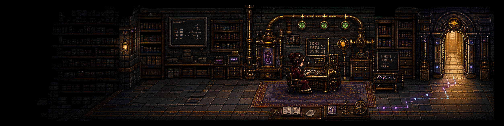

# Hi, I'm Rafael Xavier 👋

### Senior Full-Stack Software Engineer · Java · Spring Boot · React · TypeScript · AWS

I build scalable, high-availability platforms and modernize complex systems. I have 6+ years of software engineering experience across backend, frontend, cloud infrastructure, and technical leadership, including work with international teams and enterprise products.

- ☕ Building Java and Spring Boot microservices with DDD and Clean Architecture
- ⚛️ Delivering React and TypeScript applications for enterprise and customer-facing products
- ☁️ Designing and operating cloud solutions on AWS with Docker, Kubernetes, and CI/CD
- 🔍 Focused on system design, performance, security, testing, and observability
- 🌎 Based in Brazil and experienced in remote collaboration with international teams

## Core stack

  
  
  
  
  
  
  
  
  

## GitHub activity

  
  

## Connect

  
  

